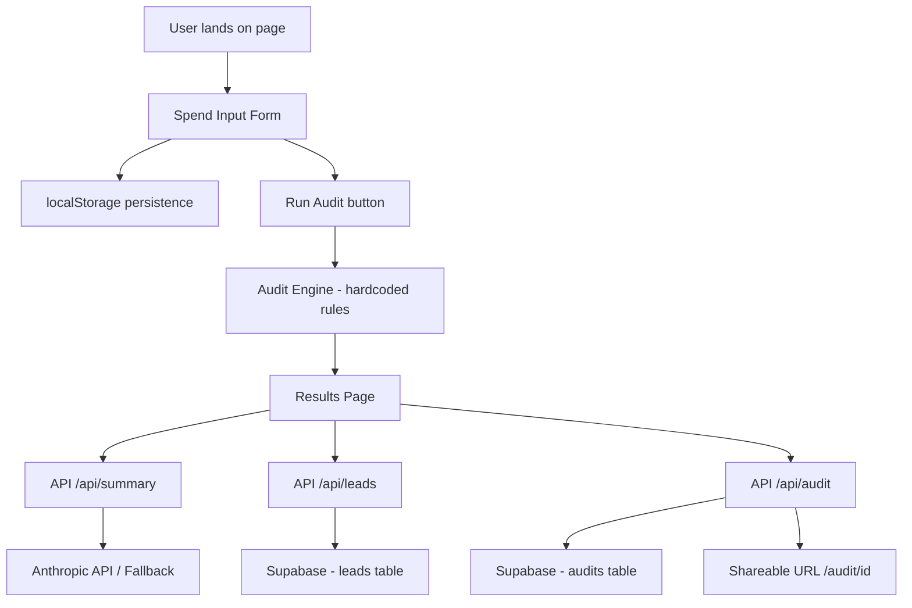

# Architecture

## System Diagram

## Data Flow

1. User fills spend form — tool, plan, seats, monthly spend
2. Form state saved to localStorage on every change
3. User clicks Run Audit — auditEngine.ts runs hardcoded rules
4. Results page renders instantly — no API call needed for core audit
5. Anthropic API called for personalized summary — fallback if it fails
6. User submits email — saved to Supabase leads table
7. User clicks Share — audit saved to Supabase audits table, unique URL generated

## Stack

- **Frontend:** Next.js 16 + TypeScript + Tailwind CSS
- **Backend:** Next.js API routes (serverless)
- **Database:** Supabase (PostgreSQL)
- **Deployment:** Vercel
- **AI:** Anthropic Claude API (with templated fallback)

**Why Next.js?**
Single framework for frontend + backend. API routes deploy as serverless functions on Vercel. App Router gives server components for the shareable audit page (good for SEO and OG tags).

**Why Supabase?**
Free tier is generous. Postgres gives us a real relational database. Built-in dashboard to view leads without building an admin panel.

**Why Tailwind?**
Fastest way to build a consistent dark UI without writing custom CSS.

## What I would change for 10k audits/day

1. **Cache audit results** — Redis or Vercel KV to avoid hitting Supabase on every shareable URL load
2. **Rate limiting** — Upstash Redis rate limiter on all API routes
3. **CDN for static assets** — already handled by Vercel Edge Network
4. **Database indexes** — add index on leads.email and audits.created_at
5. **Queue for emails** — move transactional emails to a background queue (Inngest or Trigger.dev)